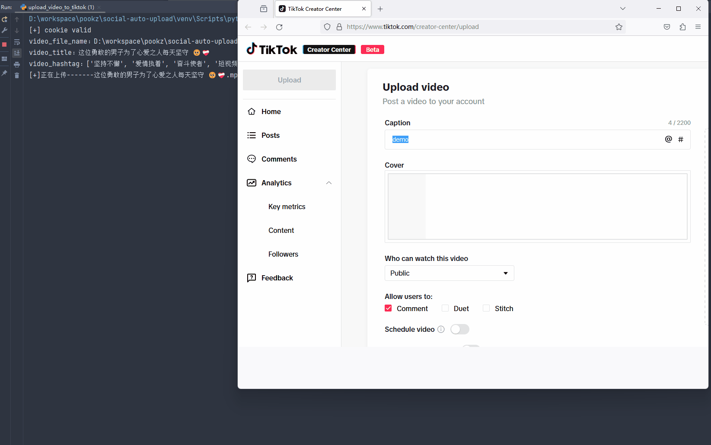

# PostSail 播舟

> 一次创作，多端抵达。

**PostSail** 是多平台自媒体内容自动发布工具：提供 **视频 / 图片笔记 / 原生文章** 发布，以及 **Web 管理台**、**统一 CLI（`sau`）** 与 **示例脚本** 三种使用方式。文章功能已接入 21 个平台：抖音、Bilibili、百家号、今日头条、微博、知乎、企鹅号、搜狐号、一点号、大鱼号、网易号、AcFun、快传号、雪球号、京东、豆瓣、CSDN、简书、车家号、易车号、懂车号，均具备执行器。代码接入与真实账号验收分别记录，见[文章平台验证记录](./docs/article-platform-verification.md)。

PostSail（播舟）是开源的多平台内容发布与运营工具。Post 表示内容发布，Sail 表示扬帆传播。

本项目在 [rehatRobot/OmniPost](https://github.com/rehatRobot/omnipost) 的基础上继续开发，原项目基于 [dreammis/social-auto-upload](https://github.com/dreammis/social-auto-upload)。感谢两层上游的作者与社区贡献者，保留原有 MIT 许可证及版权声明。

项目仓库：[zhao-yc/postsail](https://github.com/zhao-yc/postsail)。当前更新品牌展示，兼容既有安装与配置：Python 分发包名仍为 `social-auto-upload`，CLI 入口仍为 `sau`；`OMNIPOST_*` 环境变量、浏览器本地存储键与源码目录名称继续沿用。现有账号、素材和发布记录无需迁移。



---

## 目录

- [功能特性](#功能特性)
- [架构概览](#架构概览)
- [环境要求](#环境要求)
- [安装](#安装)
- [快速开始](#快速开始)
- [平台能力](#平台能力)
- [配置说明](#配置说明)
- [文档索引](#文档索引)
- [AI Agent](#ai-agent)
- [免责声明](#免责声明)
- [贡献](#贡献)
- [致谢](#致谢)
- [许可证](#许可证)

## 功能特性

- **多平台发布**：抖音、B 站、小红书、快手、视频号、百家号、今日头条、微博、搜狐号、知乎、企鹅号、TikTok 等
- **视频 + 图文**：部分平台支持图文 / 文章（见能力表）
- **独立文章管理**：富文本原稿、正文图片、平台覆盖项、各账号发布记录；支持 API 和 `sau article`，与官网独立
- **账号与 Cookie 管理**：Web 扫码 / 导入 Cookie，CLI `login` / `check`
- **消息中心**：评论与私信收件箱、人工回复、自动回复策略、话术库与消息提醒；按平台和账号权限开放，见[功能与验证范围](./docs/operations.md)
- **数据中心**：仪表盘、账号与作品快照、观测增量、排行榜、当前负责人汇总、CSV 与机器人周期报表；见[统计口径](./docs/operations.md#数据口径)
- **定时发布**：原有视频 / 图片笔记按平台支持；文章仅立即发布，定时请求明确拒绝
- **统一 CLI**：`sau <platform> <action>`，便于脚本化与 Agent 调用
- **可扩展 uploader**：每个平台独立模块，便于二开接入新平台

为什么还需要这种项目：上传是高频、重复、流程固定的工作。与其每次让通用 Browser Agent 临场解析页面，不如把已验证的发布链路固化成脚本 / CLI / Web 任务。

## 架构概览

| 部分 | 说明 |
| --- | --- |
| `sau_backend.py` | Flask API：账号、素材、发布任务 |
| `sau_frontend/` | Vue3 + Element Plus 管理台（账号 / 素材 / 发布中心 / 文章管理 / 消息中心 / 数据中心） |
| `uploader/*` | 各平台 Playwright / 专用运行时上传实现 |
| `sau_cli.py` | 统一 CLI 入口（安装后命令为 `sau`） |
| `utils/articles/` | 独立文章 API、素材、快照、串行任务与 21 个可执行平台适配器 |
| `utils/interactions/` | 互动消息、回复审计、自动策略与平台适配器 |
| `utils/analytics/` | 不可变观测快照、分析查询和机器人周期报表 |
| `examples/` | 单平台登录 / 上传示例脚本 |
| `skills/` | 面向 Agent 的平台 Skill（抖音 / 快手 / 小红书 / B 站） |
| `db/` | SQLite 账号与文件元数据 |

## 环境要求

- Python **3.10+**（推荐 3.11）
- Node.js **18+**（仅使用 Web 前端时需要）
- Windows / macOS / Linux
- 推荐使用 [`uv`](https://github.com/astral-sh/uv) 管理依赖

## 安装

详细步骤见：[安装说明](./docs/install.md) · [更新说明](./docs/update.md)

### 1. 克隆与 Python 依赖

```bash
git clone https://github.com/zhao-yc/postsail.git
cd postsail

uv venv
# Windows
.venv\Scripts\activate
# Linux / macOS
# source .venv/bin/activate

uv pip install -e .
```

安装后可直接使用 `sau` 命令（沿用上游 CLI 入口，兼容既有脚本）。

### 2. 浏览器驱动

主线使用 `patchright`（兼容 Playwright API）：

```powershell
# Windows 国内镜像示例
$env:PLAYWRIGHT_DOWNLOAD_HOST="https://npmmirror.com/mirrors/playwright"
patchright install chromium
```

文章流程使用 `playwright`。运行文章后端先安装 Web 依赖 `uv pip install -e ".[web]"`；浏览器按显式 `LOCAL_CHROME_PATH`、系统 Chrome、已安装 Playwright Chromium 的顺序选择。需要 Chromium 回退时在后端机器运行：

```bash
python -m playwright install chromium
```

### 3. 配置与数据库

```bash
# 复制配置（按需修改本地 Chrome 路径、调试开关等）
cp conf.example.py conf.py   # Windows 可用 copy

python db/createTable.py
```

**不要**把 `conf.py`、`cookies/`、`cookiesFile/`、`database.db` 提交到公开仓库。

### 4. Web 前后端（可选）

```bash
# 后端
uv pip install -e ".[web]"
python sau_backend.py
# 默认 http://localhost:5409

# 前端
cd sau_frontend
npm install
npm run dev
# 默认 http://localhost:5173
```

VS Code 和 Codex 已提供启动、停止、状态及日志入口，使用方法见
[编辑器里的本地开发入口](./docs/local-development.md)。这些入口默认使用前端 5175 端口。

## 快速开始

### 方式 A：Web 发布中心

1. 启动后端 + 前端  
2. 打开「账号管理」添加并登录平台账号  
3. 在「素材管理」上传视频 / 封面  
4. 在「发布中心」选择平台、填写标题正文、发布或预览（dry-run）

适合日常运营与多账号可视化管理。

长文章使用独立的「文章管理」页面（路由 `/articles`，默认访问 `http://localhost:5173/#/articles`）：保存原稿、插入正文图片、配置各平台标题 / 封面 / 话题 / 声明及平台专属选项，再选择账号立即发布或预览。抖音使用原生文章、B站使用专栏长图文、微博使用头条文章、企鹅号使用文章创作入口。官网沿用独立流程；PostSail 不依赖官网发布结果。结果分别记录为排队、预览完成、平台已接收、已发表或待确认，HTTP 受理不代表平台已发表。

### 方式 B：CLI（当前已接入平台）

```bash
sau douyin login --account <account_name>
sau douyin check --account <account_name>
sau douyin upload-video --account <account_name> --file videos/demo.mp4 --title "示例标题" --desc "示例简介"
sau douyin upload-note --account <account_name> --images videos/1.png videos/2.png --title "图文标题" --note "图文正文"

sau kuaishou login --account <account_name>
sau kuaishou upload-video --account <account_name> --file videos/demo.mp4 --title "示例标题"

sau xiaohongshu login --account <account_name>
sau xiaohongshu upload-note --account <account_name> --images videos/1.png videos/2.png --title "图文标题" --note "正文"

sau bilibili login --account <account_name>
sau bilibili upload-video --account <account_name> --file videos/demo.mp4 --title "示例标题" --tid 249

# 文章通过 Web 后端，使用网页账号 ID
sau article accounts --json
sau article import --file ./draft/article.md --title "示例教程" --cover ./draft/cover.png --json
sau article publish ARTICLE_ID --targets ./targets.json --preview --idempotency-key draft-preview-01 --json
sau article publish ARTICLE_ID --targets ./targets.json --idempotency-key draft-publish-01 --json
sau article status BATCH_ID --wait --json
```

更多说明：[CLI 使用说明](./docs/CLI.md) · [文章 API、CLI 与发布记录](./docs/articles.md)。`ARTICLE_ID`、`BATCH_ID` 为上一步返回的字符串 ID；目标文件包含平台和网页账号 ID。服务地址通过 `--server` 或 `OMNIPOST_API_URL` 配置。

约定简述：

- `account_name` 是你自定义的账号名，对应 `cookies/<platform>_uploader/<account_name>.json`
- 视频元数据常用：`title + desc + tags`
- 图文元数据常用：`title + note + tags`
- B 站首次相关命令会自动准备 `biliup`；登录建议在本地真实终端执行

### 方式 C：examples 脚本

适合调试单平台 uploader。已实现的文章平台共用独立 API / CLI 与网页管理入口，日常多平台发布优先使用 `sau article` 或「文章管理」；以下历史示例可供排查单平台流程：

```bash
# 登录示例
python examples/get_toutiao_cookie.py
python examples/get_sohu_cookie.py
python examples/get_zhihu_cookie.py

# 发布示例（按脚本内注释修改路径与文案）
python examples/upload_article_to_toutiao.py
python examples/upload_article_to_sohu.py
python examples/upload_article_to_zhihu.py
python examples/upload_article_to_baijiahao.py
```

抖音 / 快手 / 小红书 / B 站优先用 `sau ...`，不必再走旧示例主路径。

## 平台能力

| 平台 | 登录 | 视频 | 图文/文章 | 定时 | CLI | Skill | 备注 |
| --- | --- | --- | --- | --- | --- | --- | --- |
| 抖音 | ✅ | ✅ | ✅ | 视频/笔记支持，文章不支持 | ✅ | ✅ | 原生文章使用 `sau article`；完整真实预览已通过，已取得明确提交回执，公开文章已现场核实 |
| Bilibili | ✅ | ✅ | ✅ 专栏/长图文 | 视频支持，文章不支持 | ✅ | ✅ | 视频依赖 `biliup`；文章使用 Playwright；文章账号尚未验收 |
| 小红书 | ✅ | ✅ | ✅ | ✅ | ✅ | ✅ | 浏览器自动化 |
| 快手 | ✅ | ✅ | ✅ | ✅ | ✅ | ✅ | 浏览器自动化 |
| 视频号 | ✅ | ✅ | ❌ | ✅ | ❌ | ❌ | `tencent_uploader` |
| 百家号 | ✅ | ✅ | ✅ | 文章不支持 | ✅ 文章 | ❌ | `sau article` / Web；文章真实账号尚未验收 |
| 今日头条 | ✅ | ✅ | ✅ | 文章不支持 | ✅ 文章 | ❌ | 长文章，非微头条；文章真实账号尚未验收 |
| 搜狐号 | ✅ | ❌ | ✅ | ❌ | ✅ 文章 | ❌ | 标题 5–72 字；可选封面 **大于 450×300**、≤10MB；真实账号尚未验收 |
| 知乎 | ✅ | ❌ | ✅ | ❌ | ✅ 文章 | ❌ | 文章立即发布 / 可选预览；真实账号尚未验收 |
| 新浪微博 | ✅ | ❌ | ✅ 头条文章 | ❌ | ✅ 文章 | ❌ | 账号类型 10；文章下一步与最终微博发布分别处理，真实账号尚未验收 |
| 企鹅号 | ✅ | ❌ | ✅ 文章 | ❌ | ✅ 文章 | ❌ | 账号类型 11；独立于视频号类型 2；真实账号尚未验收 |
| 一点号 | ✅ | ❌ | ✅ 文章 | ❌ | ✅ 文章 | ❌ | 类型 12；标题 5–64 字、必填封面；真实账号尚未验收 |
| 大鱼号 | ✅ | ❌ | ✅ 文章 | ❌ | ✅ 文章 | ❌ | 类型 13；UEditor 正文；真实账号尚未验收 |
| 网易号 | ✅ | ❌ | ✅ 文章 | ❌ | ✅ 文章 | ❌ | 类型 14；Draft.js 正文、必填封面；真实账号尚未验收 |
| AcFun | ✅ | ❌ | ✅ 文章投稿 | ❌ | ✅ 文章 | ❌ | 类型 15；从会员中心读取原生文章入口、分类必填；真实账号尚未验收 |
| 快传号 | ✅ | ❌ | ✅ 文章 | ❌ | ✅ 文章 | ❌ | 类型 16；360 快传号文章入口；真实账号尚未验收 |
| 雪球号 | ✅ | ❌ | ✅ 长文章 | ❌ | ✅ 文章 | ❌ | 类型 17；长文章编辑器；真实账号尚未验收 |
| 京东 | ✅ | ❌ | ✅ 原生文章 | ❌ | ✅ 文章 | ❌ | 类型 18；京东创作服务平台文章入口；标题 15–27 字，独立封面必填；真实账号尚未验收 |
| 豆瓣 | ✅ | ❌ | ✅ 日记文章 | ❌ | ✅ 文章 | ❌ | 类型 19；无独立封面；真实账号尚未验收 |
| CSDN | ✅ | ❌ | ✅ 博客文章 | ❌ | ✅ 文章 | ❌ | 类型 20；封面、标签、摘要与创作类型必填；真实账号尚未验收 |
| 简书 | ✅ | ❌ | ✅ 文章 | ❌ | ✅ 文章 | ❌ | 类型 21；新建独立稿件，无独立封面及标签；真实账号尚未验收 |
| 车家号 | ✅ | ❌ | ✅ 原生长文 | ❌ | ✅ 文章 | ❌ | 类型 22；独立横竖封面，须明确同意上传协议；真实账号尚未验收 |
| 易车号 | ✅ | ❌ | ✅ 文章 | ❌ | ✅ 文章 | ❌ | 类型 23；独立横竖封面、六种声明及转载来源；真实账号尚未验收 |
| 懂车号 | ✅ | ❌ | ✅ 文章 | ❌ | ✅ 文章 | ❌ | 类型 24；独立横竖封面，正文标题仅支持 H1；真实账号尚未验收 |
| TikTok | ✅ | ✅ | ❌ | ✅ | ❌ | ❌ | 示例偏 Chrome 版实现 |

平台后台改版、风控、账号权限（如实名）会导致自动化失效，属正常现象，需要跟进维护选择器与流程。

能力表中的 ✅ 表示代码接入，不表示真实账号验收通过。21 个文章平台均已开放执行，能力 API 分别返回 `live_verified` 和 `verification.preview/submitted/published`，并公开 `option_fields` 与权限检查说明。2026-10-01 已现场验证抖音的一篇原生文章：标题、完整正文、三张正文图顺序、平台图片地址与高清封面读回通过；正式提交取得官方成功回执及内容 ID，[抖音公开文章](https://www.douyin.com/article/7691535675165871406)已独立打开核实。此次未验收真实原生话题或声明；其余 20 个平台缺少验收账号，保持未验证。京东和三个汽车平台补充了官方组件的离线浏览器验证，仍未执行真实账号登录、素材上传或发布，`live_verified:false`。具体记录见[文章平台验证记录](./docs/article-platform-verification.md)。

## 配置说明

- 配置模板：[`conf.example.py`](./conf.example.py) → 复制为 `conf.py`
- Cookie 目录：`cookies/`（CLI / 示例）与 `cookiesFile/`（Web 账号）
- 素材目录：常见为 `videoFile/`（以后端实际配置为准）
- 文章素材与截图：`articleData/`，连同 `db/database.db`、`cookiesFile/` 备份迁移
- 日志：`logs/`

开源或分享仓库前请确认敏感文件已被忽略，可参考 [`.gitignore`](./.gitignore)。

## 文档索引

| 文档 | 内容 |
| --- | --- |
| [docs/install.md](./docs/install.md) | 安装与环境 |
| [docs/update.md](./docs/update.md) | 更新说明 |
| [docs/CLI.md](./docs/CLI.md) | `sau` CLI |
| [docs/articles.md](./docs/articles.md) | 独立文章管理、API、CLI、任务状态与验收边界 |
| [docs/article-platform-verification.md](./docs/article-platform-verification.md) | 文章平台原生入口、公开依据与逐平台验收状态 |
| [docs/operations.md](./docs/operations.md) | 消息中心、数据中心、自动回复与周期报表 |
| [docs/agent-bootstrap.md](./docs/agent-bootstrap.md) | 交给 AI Agent 的启动提示词 |
| [docs/legacy-web.md](./docs/legacy-web.md) | 历史 Web 与当前文章管理入口的区别 |
| [skills/*/SKILL.md](./skills) | 各平台 Agent Skill |

## AI Agent

如果你把本仓库交给 OpenClaw、Codex、Claude Code 等使用：

1. 先发送仓库 + [Agent Bootstrap Prompt](./docs/agent-bootstrap.md)  
2. 优先让 Agent 走 `uv` + `sau` + `skills/`  
3. 先验证：`douyin` / `kuaishou` / `xiaohongshu` / `bilibili` 四个 CLI 入口  

相关 Skill：

- [Douyin](./skills/douyin-upload/SKILL.md)
- [Kuaishou](./skills/kuaishou-upload/SKILL.md)
- [Xiaohongshu](./skills/xiaohongshu-upload/SKILL.md)
- [Bilibili](./skills/bilibili-upload/SKILL.md)

## 免责声明

- 本项目仅供学习、研究与个人效率提升使用。  
- 使用自动化发布可能违反部分平台用户协议，存在账号限制、验证码、功能不可用等风险，**后果由使用者自行承担**。  
- 请勿用于垃圾信息、违规内容分发或其他违法用途。  
- 平台页面与接口随时变更，不保证某一功能长期可用。

## 贡献

欢迎 Issue / PR：

1. Fork 本仓库  
2. 新建分支：`feature/xxx` 或 `fix/xxx`  
3. 提交清晰的变更说明  
4. 发起 Pull Request  

建议：改动平台自动化时附上复现步骤、日志片段（`logs/`）与是否 dry-run。

## 致谢

- 原项目：[dreammis/social-auto-upload](https://github.com/dreammis/social-auto-upload)
- B 站上传能力基于 [biliup](https://github.com/biliup/biliup) 的接入与封装
- 所有提交 Issue、PR 与反馈的贡献者

## 许可证

本项目采用 [MIT License](./LICENSE)。

使用或二次发布时，请保留许可证与版权声明，并保留对上游项目与 `biliup` 的致谢信息。
