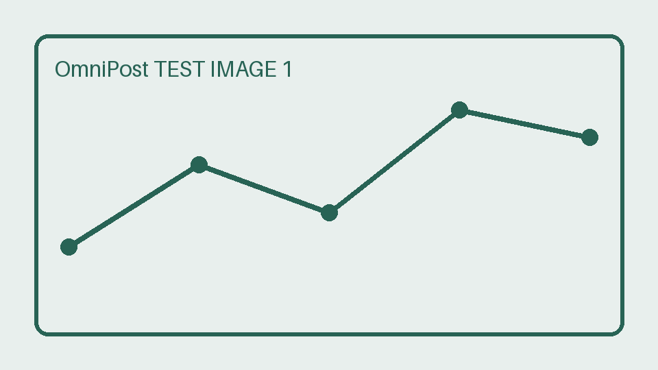
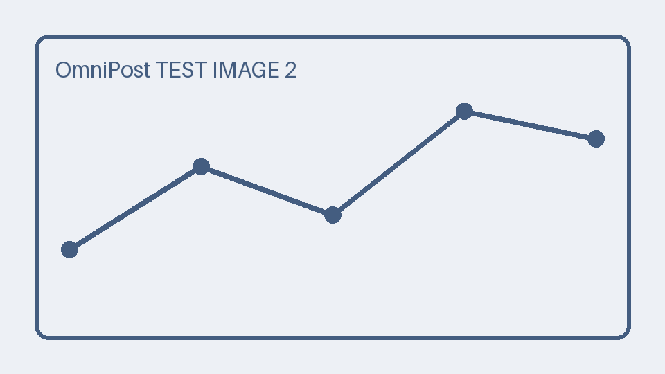
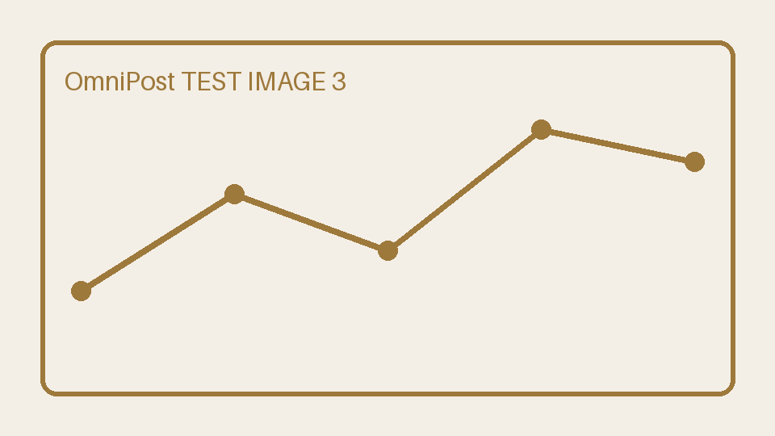

# PostSail 图文发布测试，请忽略

本文仅用于 PostSail 多平台图文功能验收，不是对外宣传文章。正式验收前请确认使用的是测试账号。

## 中文标题与加粗

第一段用于核对中文标点、**加粗内容**和[项目链接](https://github.com)。发布后应完整保留这段文字及链接。



第一张图片应位于本段之前，第二张图片应位于以下列表之后。

- 文章原稿独立保存。
- 不同平台独立记录结果。
- 一个目标失败时，其余目标继续执行。

> 这是一段验收用引用，应保留引用排版。



## 表格与代码

| 验收项目 | 期望结果 |
| --- | --- |
| 表格 | 原生表格或清晰图片，顺序不变 |
| 代码块 | 保留可读内容，必要时转图片 |
| 正文图片 | 三张，均完成平台上传 |

```python
# 仅为文章排版示例，不会被执行。
def 发布测试状态():
    return "等待平台回执"
```

1. 先核对平台预览及图片顺序。
2. 再核对正式提交的回执及审核状态。



第三张图片之后是本篇测试文章的结束段。验收完成后请在平台按测试账号的管理约定处理该文章。
